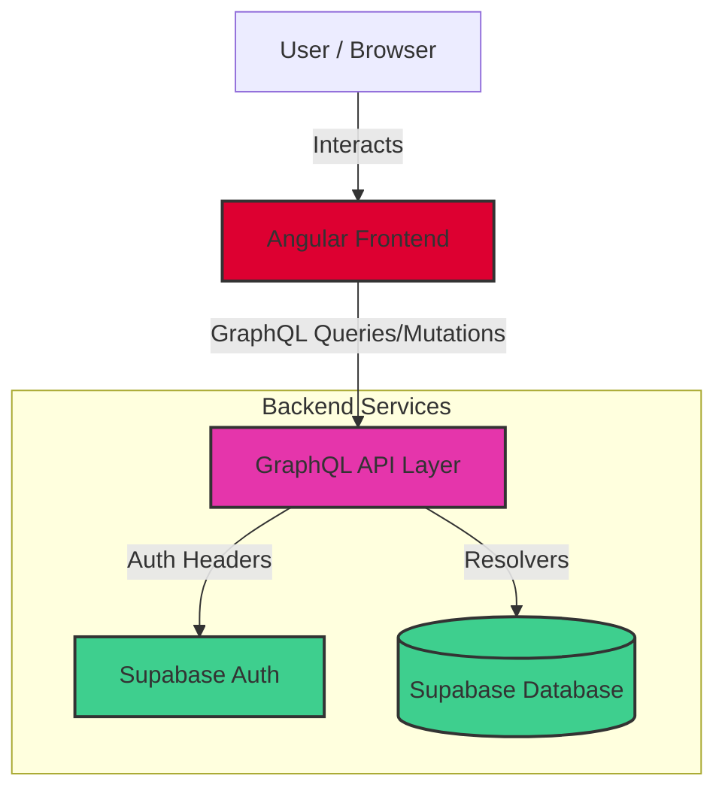
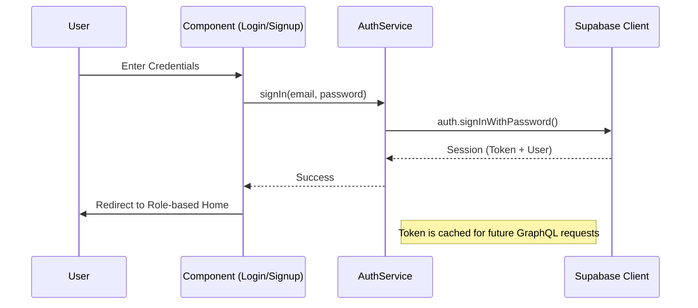
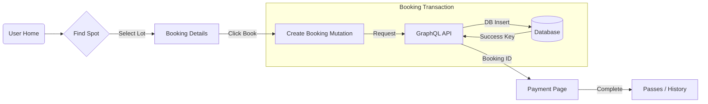
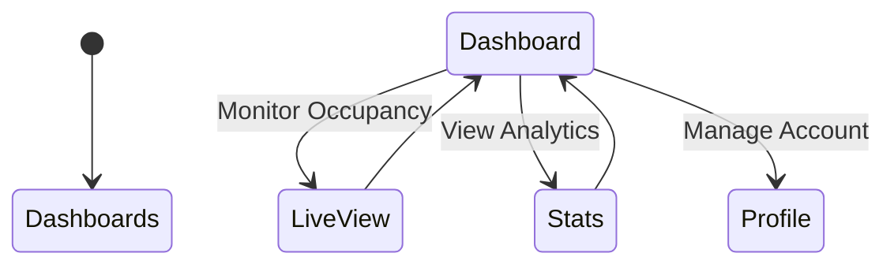
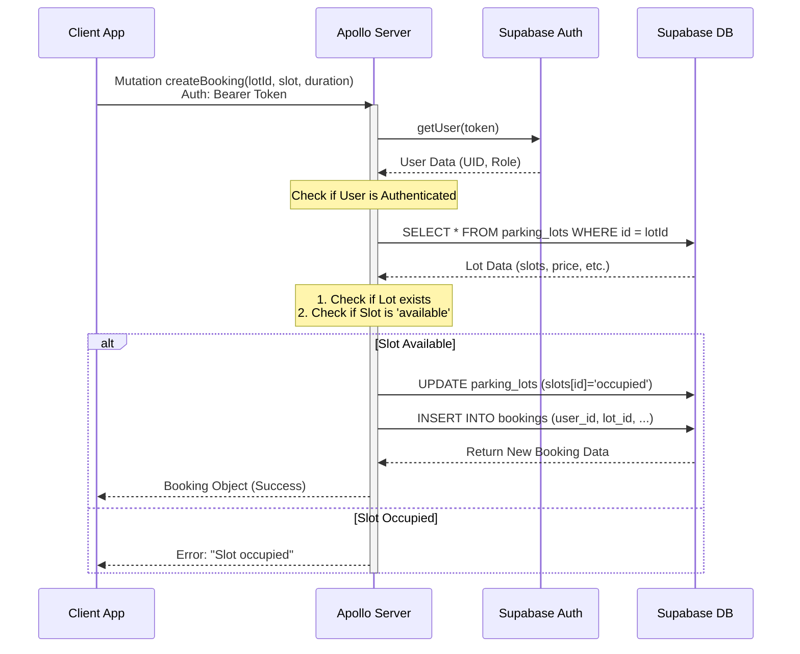

# Project Workflows & Architecture

This document visualizes the core workflows and architecture of the KERA AI Urban Parking application.

## 1. High-Level Architecture
This diagram shows how the Frontend connects to the Backend services.

## 2. Authentication Workflow
How users enter the system and establish a session.

## 3. User Booking Journey
The primary flow for a driver booking a parking spot.

## 4. Operator Workflow
The flow for parking lot managers.

## 5. Backend Architecture & Request Flow
The backend is a **Serverless GraphQL API** on Vercel connecting to Supabase.

### Request Lifecycle
1.  **Client** sends POST to `/graphql` via `auth.service` (with Supabase Token).
2.  **Vercel** routes to `api/src/index.ts`.
3.  **Auth Middleware** validates the token and attaches the `user` to context.
4.  **Apollo Server** matches the Schema and executes the Resolver.
5.  **Resolver** acts on Supabase DB tables (`profiles`, `parking_lots`, `bookings`).

### Booking Sequence (End-to-End)
This diagram details the logic when a booking is created, including validation.

